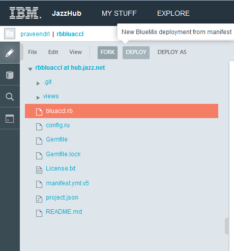

A Ruby application that uses the AnalyticsWarehouse Service on IBM BlueMix
-----------------------------------------------------------------------

Sample ruby application demostrating usage of AnalyticsWarehouse service on Bluemix PaaS. This applications uses DB2 and googlecharts ruby gems to query the AnalyticsWarehouse database and display results as a graph.

Running the application on your Desktop
---------------------------------------

1) Download the application source as a zip and unzip in a work directory. [EDIT CODE -> File -> Export -> zip]

2) From your work directory issue the following command to install necessary dependencies.

```bash
bundle install
```

Note: before running the command ensure you visit the dependency gem Homepage to know if any specifics needed for respective gem installation

3) Edit the file bluaccl.rb to add your local database credentials

4) Run your application issuing the following command

```bash
rackup
```

5) Access http://localhost:9292 to see app's HomePage

Deploying the application on Bluemix from jazzHub
-------------------------------------------------
1) Fork this repository as a new project under your account


2) Rename the file manifest.yml.v5 to manifest.yml


3) Edit the manifest.yml file to provide hostname, appname and service name of your choice [Optional: needed only to ensure there is no conflict if the name is already in use]

4) Click on the deploy button to deploy the app onto Bluemix PaaS



Deploying the application from command line using the cf tool
-------------------------------------------------------------
Before we being, ensure the command line tool [**cf**](https://github.com/cloudfoundry/cli/releases) is installed and ready to use.

```bash
cf -v
```

1) Clone your repository into your working directory

```bash
git clone https://hub.jazz.net/git/praveendrl/rbbluaccl
```

2) Enter into directory **rbbluaccl**

3) Rename the file manifest.yml.v5 to manifest.yml

4) Edit the manifest.yml file to provide hostname, appname and service name of your choice [Optional: needed only to ensure there is no conflict if the name is already in use]

5) Set cf target to https://api.ng.bluemix.net/ and login using your bluwmix id

```bash
cf target https://api.ng.bluemix.net/
```

6) Issue cf push to deploy the application on Bluemix

```bash
cf push
```

License
-------
The app is licensed under MIT. Refer to License.txt
